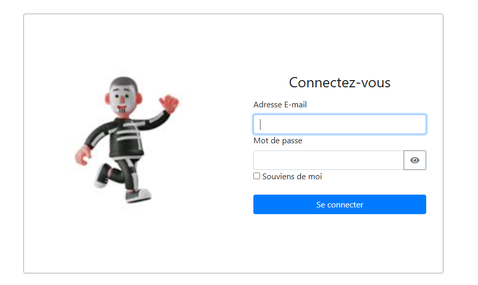
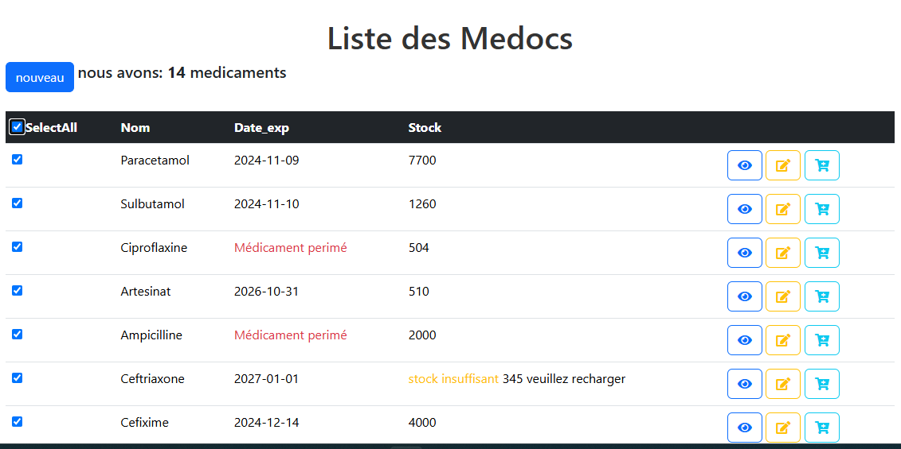
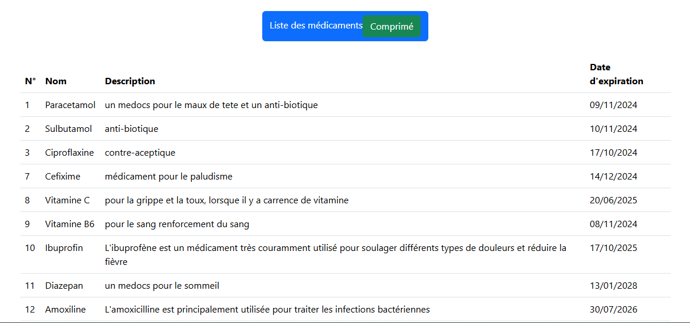
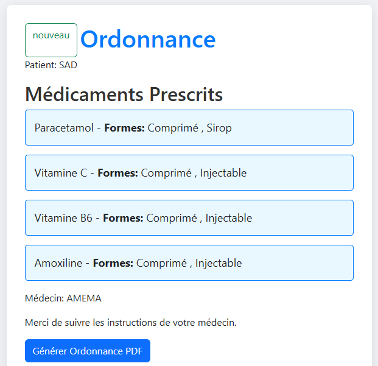
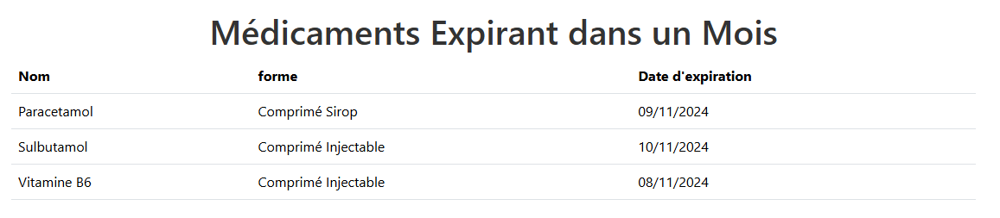
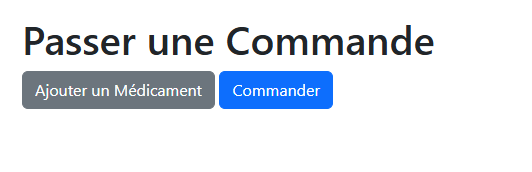
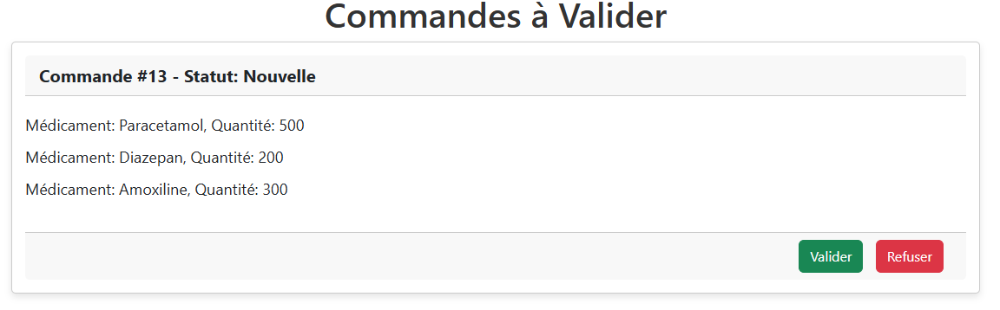

# Gestion de Médicaments

## Description
Ce projet est une application Symfony pour la gestion de médicaments. Il permet de suivre les stocks, d'ajouter de nouveaux médicaments, de suivre la garentie de medicament, donc question d'expiration pour eviter que les patients prennent de medocs perimés, de gérer les prescriptions(Ordonnance) et de gérer les commandes.

 ## Installation
 ### Prérequis
- PHP 8.0 ou supérieur
- Composer
- Node.js et npm
- Une base de données MySQL

1. Clonez ce dépôt :
   ```sh
   git clone https://github.com/AmemaBanangana/medocs.git
   cd gerstion-medocs
Nos informations de base de données :
DATABASE_URL="mysql://root:@127.0.0.1:3306/gestion_medoc?serverVersion=10.11.2-MariaDB&charset=utf8mb4"

Fonctionnalités
Gestion des stocks de médicaments

Ajout de nouveaux médicaments

passer des commandes en cas d'insuffissance au stock

Gestion des prescriptions

Notifications en cas de seuils critiques de stock et expiration de medicament
## apercue de la page de connexion


## apperçue de la page de gestion de medica,ent


## appercue de de la page de medicament selectionnés selon la forme(Comprimé)


## Page de la prescription de medicament


## Page de medicament encours d'expiration


## Page pour passer de commande


## Page pour validation de commande
